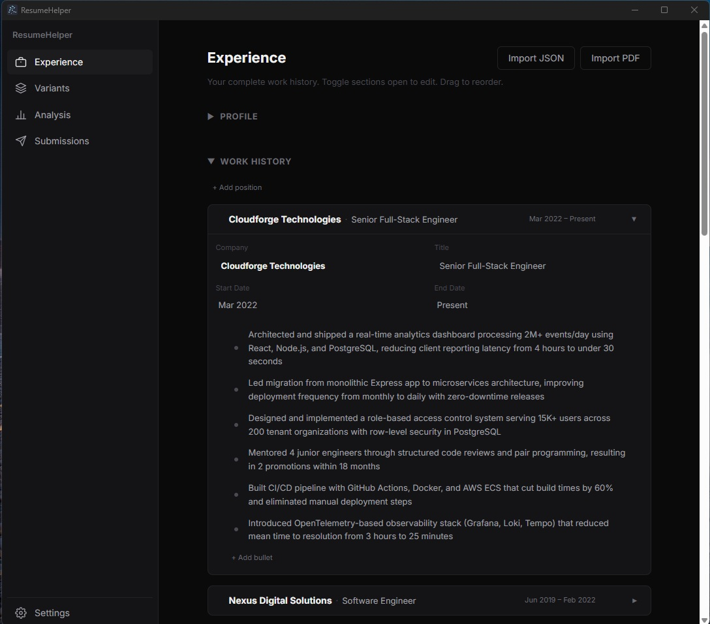
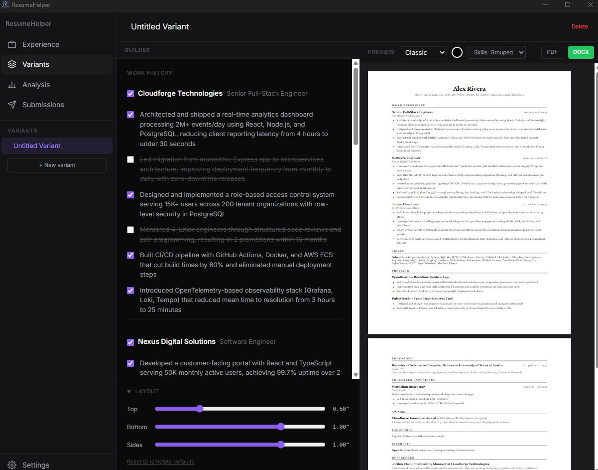
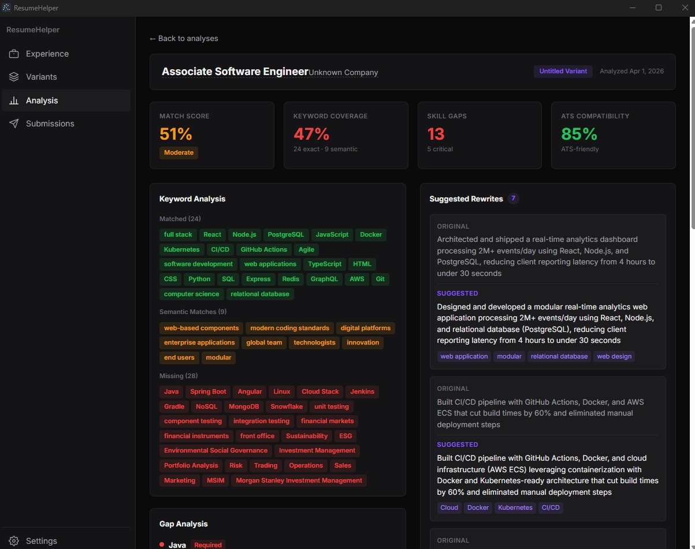
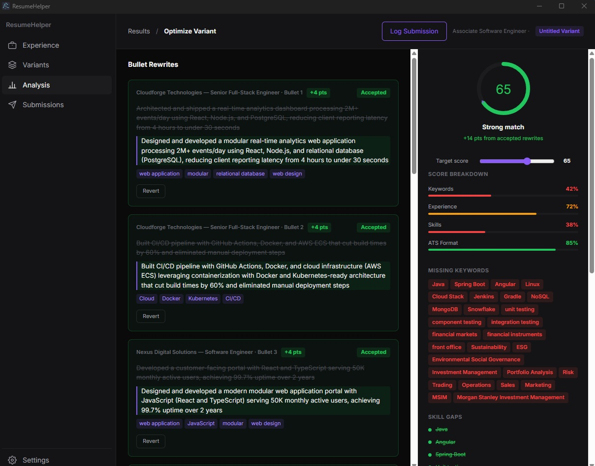
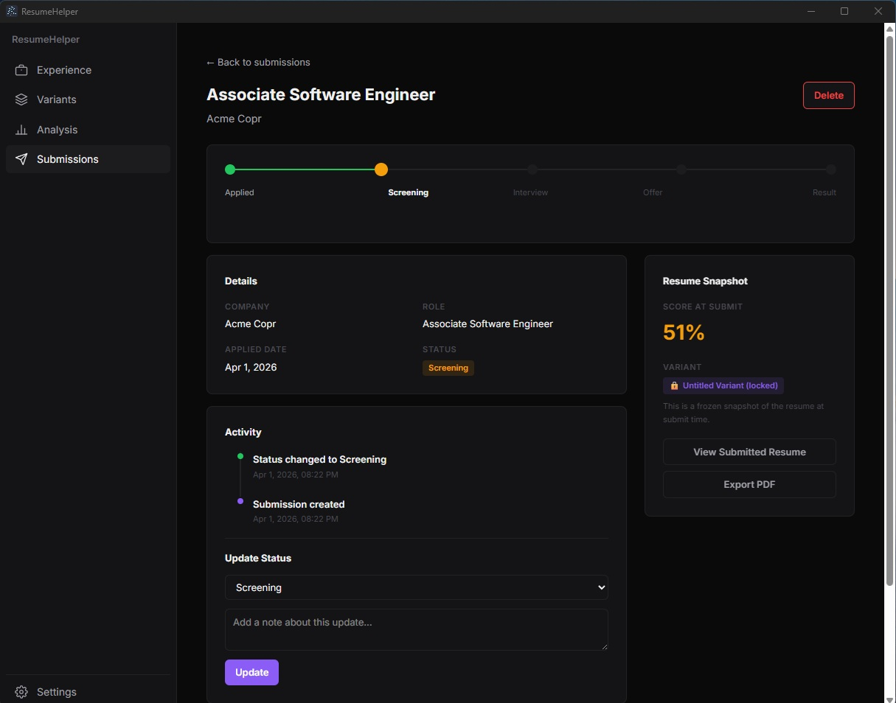

# ResumeHelper

A desktop app for managing, tailoring, and tracking job applications. Store all your work experience in one place, create targeted resume variants for different roles, and use AI to analyze how well your resume matches a job posting — with match scores, keyword coverage, gap analysis, and bullet rewrite suggestions.

## What it does

- **Experience database** — Store your full work history, skills, projects, education, and more. Toggle individual bullet points on/off per job.
- **Resume variants** — Create multiple resume versions by selecting which experience, bullets, and skills to include. Each variant is a tailored view of your data.
- **AI-powered analysis** — Paste a job posting or fetch one from a URL, then run it against a variant. Get a match score (0–100), keyword coverage (exact/semantic/missing), gap analysis (critical vs. moderate), and per-bullet rewrite suggestions.
- **ATS score threshold** — Set a minimum match score target per variant. The score ring shows threshold-relative coloring, a target arc, and a below-target callout with pending rewrite counts. A soft warning appears when submitting below your target.
- **Bullet suggestions** — Review AI-suggested rewrites side by side with your originals. Accept or dismiss each one individually. The AI rewrites to match job posting language but never fabricates experience.
- **Submission tracking** — Log every job application with a frozen resume snapshot. Track each through pipeline stages (Applied → Screening → Interview → Offer → Result). Filter by status, search by company, see response rates and score averages.
- **PDF and DOCX export** — Export any variant as PDF (with theme support) or Word document.
- **Import from PDF or JSON** — Import your experience data from an existing PDF resume (AI-powered extraction) or a resume.json file. Data is parsed into the structured database for immediate use.

## Screenshots

### Experience database
Store your full work history with expandable sections. Import from JSON or PDF.



### Variant builder
Toggle bullets on/off to create tailored resume versions. Live PDF preview with template selection and margin controls.



### AI analysis results
Match score, keyword coverage (exact/semantic/missing), gap analysis, ATS compatibility, and per-bullet rewrite suggestions.



### Score optimization
Review and accept AI-suggested rewrites. Track score improvements in real time against your target threshold.



### Submission tracking
Log applications with frozen resume snapshots. Track each through pipeline stages with an activity timeline.



## Getting started

### Prerequisites

- Node.js 18+
- npm

### Install and run

```bash
git clone https://github.com/markmck/resumehelper.git
cd resumehelper
npm install
npm run dev
```

### Build for distribution

```bash
npm run build:win    # Windows
npm run build:mac    # macOS
npm run build:linux  # Linux
```

## Setting up AI analysis

The AI features require an API key from either Anthropic (Claude) or OpenAI.

1. Open the app and click **Settings** in the sidebar
2. Select your **provider** (Claude or OpenAI)
3. Choose a **model** (e.g. Claude Sonnet, GPT-4o)
4. Paste your **API key** — use the eye toggle to verify it before saving
5. Click **Test Connection** to confirm it works

Your API key is encrypted using your OS keychain (Electron safeStorage) and never leaves the main process. The renderer only knows whether a key is configured, not what it is.

Once configured, go to the **Analysis** tab, paste a job posting (or fetch one from a URL), select a variant, and click Analyze.

## Tech stack

- Electron + React 19 + TypeScript
- Drizzle ORM + SQLite (local database)
- Tailwind CSS 4 + custom design system tokens
- Claude / OpenAI APIs (user-supplied key)

## License

Private — not currently open source.
